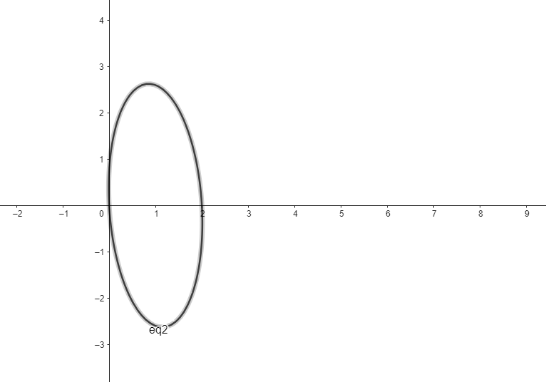

```{r setup, include=FALSE}
knitr::opts_chunk$set(echo = TRUE, comment = NULL, size = "tiny", warning = FALSE)
options(width = 100)
setwd("O:/itam/ApuntesGit/multivariate-methods/Tareas/Tarea1")
```

```{r}
```

```{r}
library(dplyr)
library(lattice)
library(tidyverse)
library(ggplot2)
library(ggExtra)
library(plotly)
library(aplpack)
library(pander)

```

# Ejercicio 1.2)
## a)
scatterplot
A morning newspaper lists the following used-car prices for a foreign compact with age $x_i$ measurred in years and selling price $x_2$ measurred in thousands of dollars.

```{r}
x1 <- c(1, 2, 3, 3, 4, 5, 6, 8, 9, 11)
x2 <- c(18.95, 19, 17.95, 15.54, 14, 12.95, 8.94, 7.49, 6, 3.99)
datos <- data.frame(x1, x2)

(plot <- ggplot(datos, aes(x1, x2)) + geom_point())
```

marginal dot diagram

```{r}
plot1 <- ggMarginal(plot, type="histogram")
plot2 <- ggMarginal(plot, type="boxplot")
plot3 <- ggMarginal(plot, type="density")

plot1
plot2
plot3

```

## b) 
Infiero que la covarianza es negativa porque hay una tendencia: entre más años tiene el carro, en menos precio se vende.

## c)

```{r}
m1 <- mean(x1)
m2 <- mean(x2)

s11 <- var(x1)
s22 <- var(x2)

s12 <- cov(x1, x2)
r12 <- cor(x1, x2)

cat("media x1: ", m1, "\n", 
       "media x2: ", m2, "\n",
       "varianza x1: ", s11, "\n",
       "varianza x2: ", s22, "\n",
       "covarianza: ", s12, "\n",
       "correlación: ", r12, "\n")
```
Interpretación:

Media x1: 5.2 años. Representa el valor central de los años de antigüedad de los autos.

Media x2: $12,481. Indica el valor central de los precios de los autos.

Varianza x1: 10.62222. Refleja la dispersión de los años de antigüedad de los autos alrededor de su valor central.

Varianza x2: 30.85437. Muestra la dispersión de los precios de los autos alrededor de su valor central.

Covarianza: -17.71022. Indica cómo varían conjuntamente los años de antigüedad y los precios de los autos. Una covarianza negativa sugiere que los autos más antiguos tienden a tener precios más bajos, y viceversa.

Correlación: -0.9782684. Representa la fuerza y la dirección de la relación entre los años de antigüedad y los precios de los autos. Una correlación negativa cercana a -1 indica una fuerte relación inversa: a medida que los años de antigüedad aumentan, los precios tienden a disminuir

## d)
```{r}
colMeans(datos)
var(datos)
cor(datos)
```

# Ejercicio 1.4)

## a)
```{r}
df <- data.frame(
  x1 = c(108.28, 152.36, 95.04, 65.45, 62.97, 263.99, 265.19, 285.06, 92.01, 165.68),
  x2 = c(17.05, 16.59, 10.91, 14.14, 9.52, 25.33, 18.54, 15.73, 8.10, 11.13),
  x3 = c(1484.10, 750.33, 766.42, 1110.46, 1031.29, 195.26, 193.83, 191.11, 1175.16, 211.15))

plot <- ggplot(df, aes(x1, x2)) + geom_point()
plot1 <- ggMarginal(plot, type="histogram")
plot2 <- ggMarginal(plot, type="boxplot")
plot3 <- ggMarginal(plot, type="density")

plot1
plot2
plot3
```
Las ventas tienen mucha variabilidad y no parece seguir una distribución normal porque se cargan mucho los datos a la izquierda (es difícil tener ventas grandes). La ganancia parece estar también muy cargada, en general no se dan ganancias grandes, pero sí aumenta conforme aumentan las ventas.

## b)

```{r}
m1 <- mean(df$x1)
m2 <- mean(df$x2)

s11 <- var(df$x1)
s22 <- var(df$x2)

s12 <- cov(df$x1, df$x2)
r12 <- cor(df$x1, df$x2)

cat("media x1: ", m1, "\n", 
       "media x2: ", m2, "\n",
       "varianza x1: ", s11, "\n",
       "varianza x2: ", s22, "\n",
       "covarianza: ", s12, "\n",
       "correlación: ", r12, "\n")
```
La correlación no llega a ser fuerte, pero sí hay cierta tendencia entre ambas variables que nos permite decir que ante un aumento de ventas, hay un aumento en el profit.


# Ejercicio 1.6)
## a)
```{r}
datos <- read.table("data/T1-5.DAT", header = FALSE)
colnames(datos) <- c("Wind", "Solar_radiation", "CO", "NO", "NO2", "O3", "HC")

pairs(datos, pch = 19)

g1 <- ggplot(datos, aes(x = Wind)) +
  geom_histogram()

g2 <- ggplot(datos, aes(x = Solar_radiation)) +
  geom_histogram()

g3 <- ggplot(datos, aes(x = CO)) +
  geom_histogram()

g4 <- ggplot(datos, aes(x = NO)) +
  geom_histogram()

g5 <- ggplot(datos, aes(x = NO2)) +
  geom_histogram()

g6 <- ggplot(datos, aes(x = O3)) +
  geom_histogram()

g7 <- ggplot(datos, aes(x = HC)) +
  geom_histogram()


g1
g2
g3
g4
g5
g6
g7
```

## b)
```{r}
x <- colMeans(datos)
S <- var(datos)
R <- cor(datos)

x
S
R
```
Interpretación:

el vector de medias x nos dice el nivel que podemos esperar de cada medida tomada por el estudio en Los Ángeles, de tal forma que podemos esperar niveles de CO de 4.54 en un día cualquiera en Los Ángeles.

La matriz S nos permite ver un poco sobre la proporcionalidad entre pares de mediciones. Si el signo del elemento $ s_{2,1} $ es negativo, como es el caso, podemos observar que las variables Solar_radiation y Wind tienen tendencias a ser inversamente proporcionales. Al contrario si el signo es positivo, podemos argumentar que hay cierta proporcionalidad o tendencias a ello.

La matriz R nos permite ver la magnitud con la que covarían cierto par de variables, con esto podemos observar que la relación que tienen las variables entre ellas no es para nada fuerte, la correlación más fuerte es 0.55, que pertenece al par de variables (NO2, CO).

# Ejercicio 1.8


## a)

$Dado\left(P,Q\right)=\sqrt{\left(x_1-y_1\right)^2+\ldots+\left(x_p-y_p\right)^2}\ y\ P=\left(-1,-1\right)Q=\left(1,0\right)$

$\rightarrow\ d\left(P,Q\right)=\sqrt{\left(-1-1\right)^2+\left(-1-0\right)^2}=\sqrt{\left(-2\right)^2+\left(-1\right)^2}=\sqrt{4+1}=\sqrt5$

## b)

$Dado\ d\left(P,Q\right)=\sqrt{a_{11}\left(x_1-y_1\right)^2+2a_{12}\left(x_1-y_1\right)\left(x_2-y_2\right)+{a_{22}\left(x_2-y_2\right)}^2}$
$P=\left(-1,-1\right)\ Q=\left(1,0\right)\ \ a_{11}=\frac{1}{3}\ \ a_{22}=\frac{4}{27}\ \ a_{12}=\frac{1}{9}$
$\sqrt{{\frac{1}{3}\left(-1-1\right)}^2+\frac{4}{27}\left(-1-0\right)^2+\left(-1-1\right)\left(-1-0\right)\frac{1}{9}}$
$=\sqrt{\frac{4}{3}+\frac{4}{27}+\frac{2}{9}}=\sqrt{\frac{36+4+6}{27}}=\sqrt{\frac{46}{27}}$

## c)


# Ejercicio 1.10

$Para\ que\ una\ función\ sea\ considerada\ una\ metrica\ se\ deben\ de\ cumplir\ las\ siguientes\ propiedades:$

$d\left(x,y\right)\geq0$

$d\left(x,y\right)=d\left(y,x\right)$

$d\left(x,z\right)\le\ d\left(x,y\right)+d\left(y,z\right)$

$d\left(x,y\right)=0\ \ sii\ \ \ x=y$

## a)
$Para\ d\left(P\right)=x_1^2+4x_2^2+x_2x_1$
  	
$No\ se\ cumple,ya\ que\ para\ p=\left(1,3\right)\ y\ q=\left(3,1\right)\ d\left(x,y\right)\neq\ d\left(y,x\right)$

$1+4\ast9+3=9+4+3\rightarrow40=16\ \ \ !$

## b)
$Para\ d(P)=x^2_1-2x_2^2\ $

$No\ se\ cumple,ya\ que\ para\ p=\left(1,3\right)\ \ d\left(x,y\right)<0$

$1-2\ast9<=0 \  ->\  -17>=0\ !$


# Ejercicio 1.12

## a)

$Sea\ d\left(O,P\right)=\max{\left(\left|x_1\right|,\left|x_2\right|\right)}$

$Para\ P=\left(-3,4\right)=\max{\left(\left|-3\right|,\left|4\right|\right)}=\max{\left(3,4\right)}=4$

## b)


## c)

$Basandonos\ en\ la\ expresión\ original,\ podemos\ generalizar\ la\ expresión\ a\ p\ dimensiones\ de\ $

$\mathrm{la\ siguiente\ manera\ d}\left(\mathrm{P,O}\right)\mathrm{\mathrm{=}}\mathrm{max}{\left(\left|\mathrm{x}_\mathrm{1}\right|\mathrm{,} \left|\mathrm{x}_\mathrm{2}\right|\mathrm{,\ldots,} \left|\mathrm{x}_\mathrm{p}\right|\right)}$

# Ejercicio 1.14

## a)

```{r pressure, echo=FALSE}

data <- read.table("data/T1-6.dat")
data$estado <- ifelse(data$V6 == 1, "Positive", "Non-Positive")

esclerosis <- data[data$V6==1, ]
ggplot(esclerosis, aes(x=V2, y=V4)) +
  geom_point()+
  geom_smooth(method=lm, se=FALSE)
```

Paceriera seguir un comportamiento lineal con correalación positiva,  ya que al ajustar una regresión lineal a este conjunto de datos podemos ver de mejor manera esta posible relación.

## b)
Medias para ambas clases

```{r,echo=FALSE}

pander(aggregate(data[, 0:5], list(data$estado), mean))
```
Para esclerosis esto resulta $S_n$
```{r,echo=FALSE}

n <- nrow(esclerosis)
S <- var(esclerosis[, 0:5])
Sn <- (n-1)/n * S
pander(Sn)
```

Para no esclerosis esto resulta $S_n$

```{r,echo=FALSE}
noEsclerosis <- data[data$V6==0, ]
n <- nrow(noEsclerosis)
S <- var(noEsclerosis[, 0:5])
Sn <- (n-1)/n * S
pander(Sn)
```
Para esclerosis esta es la matriz R

```{r,echo=FALSE}
pander(cor(esclerosis[, 0:5]))
```
Para no esclerosis esta es la matriz R
```{r,echo=FALSE}
pander(cor(noEsclerosis[, 0:5]))
```

# Ejercicio 1.16

Falta

# Ejercicio 1.18
Convertir los datos de la tabla a rapidez medida en m/s. Calcular $\bar{x}$,$S_n$, $R$. Interpretar las correlaciones a pares. 

```{r}
datos <- read.table("data/T1-9.DAT")

datos <- datos %>% mutate(speed_100 = 100 / V1, speed_200 = 200 / V2,
speed_400 = 400 / V3, speed_800 = 800 / (V4 * 60),
speed_1500 = 1500 / (V5 * 60), speed_3000 = 3000 / (V6 * 60),
speed_marathon = 42195 / (V7 * 60))
X <- datos %>% select(speed_100, speed_200, speed_400,
speed_800, speed_1500, speed_3000, speed_marathon)
```

Vector de medias
```{r}
x_bar <- colMeans(X)
x_bar
```

Matriz de covarianza
```{r}
n <- nrow(X)
S <- var(X)
Sn <- (n-1)/n * S
Sn
```

Matriz de correlaciones
```{r}
R <- cor(X)
R
```
Se puede observar que todas las correlaciones entre los valores de rapidez son positivas. Se puede observar que 
después del valor 1 de la diagonal principal, las correlaciones tienden a disminuir y antes del valor tienden a aumentar. 
Cuando la disntancia aumenta el tiempo en completarlo también aumenta, pero naturalmente, la rapidez promedio para
completar un maratón es menor que la de un circuito de 100 m.  

# Ejercicio 1.20

```{r, echo=FALSE, eval=knitr::is_html_output()}
datos <- read.table("data/T11-4.DAT")

fig <- plot_ly(datos, x = ~V1, y = ~V2, z = ~V3)

fig
```
```{r, echo=FALSE, eval=!knitr::is_html_output()}
# library(webshot)

# datos <- read.table("data/T11-4.DAT")
# fig <- plot_ly(datos, x = ~V1, y = ~V2, z = ~V3)

# # Save the plotly plot as a HTML file
# htmlwidgets::saveWidget(fig, "temp_plot.html", selfcontained = TRUE)

# # Take a screenshot of the plot
# webshot("temp_plot.html", "plot.png", vwidth = 900, vheight = 500)
``` 


Se puede observar que una gran cantidad de puntos se concentran en un cúmulo alrededor 
del (-0.2, 0.4) en el eje x, (-0.2, 0.2) en el eje y, (1, 3.27) en el eje z.
El punto con las coordenadas (0.58, 0.04, 5.06) parece ser un dato atípico. 
b) Colorear los puntos de acuerdo a los que están en bancarrota ¿Hay alguna orientación 
en la que se pueden distinguir las compañías en bancarrota de las que no lo están? 
¿Existen observaciones que pueden llegar a tener un impacto significativo en alguna regla para
clasicar nuevas empresas?
```{r}
datos$V5 <- as.factor(datos$V5)

fig <- plot_ly(datos, x = ~V1, y = ~V2, z = ~V3, color = ~V5,
colors = c("#FF0000", "#0000FF"))
fig
```
Si orientamos el eje X con x2, el eje y con x3 y el eje z con x1 se puede disntiguir a 
una gran mayoría de las compañías en bancarrota, específicamente, las que están en bancarrota 
tienden a tener menor x2, menor x3 y menor x1.
En las empresas que no están en bancarrota un punto que puede tener un gran impacto puede ser el (0.14, -0.03, 0.46) debido a
que presenta un valor de x3 muy bajo. En el caso de las que sí están en bancarrota podría ser el (0.37, 0.11, 1.99) debido a 
su valor mayor de x1.  

# Ejercicio 1.22

```{r}
datos <- read.table("data/T6-12.DAT") %>% select(V1, V2, V3, V4)
```

```{r}
x_bar <- colMeans(datos)
x_bar
```

## a) Graficar el dataset en 3 dimensiones.
```{r}
fig <- plot_ly(datos, x = ~V1, y = ~V2, z = ~V3)
fig
```

## b) Checar outliers.
Un valor que parece ser un outlier es el (-0.45, -0.41, 1.09)
ya que sus valores en las tres coordendas son menores que la media. 

# Ejercicio 1.24

Representar el dataset con caras de Chernoff ¿Existen diferentes grupos?

```{r}
datos <- read.table("data/T12-4.DAT") %>% select(V1, V2, V3, V4, V5, V6, V7, V8)

faces(datos, face.type = 1)
```

Existen algunas compañías que sus representaciones se parecen, por ejemplo, la 7, 9, 12 y la 11, 15, 17.

# Ejercicio 1.26
```{r}
data <- read.table("data/T1-10.dat")

```