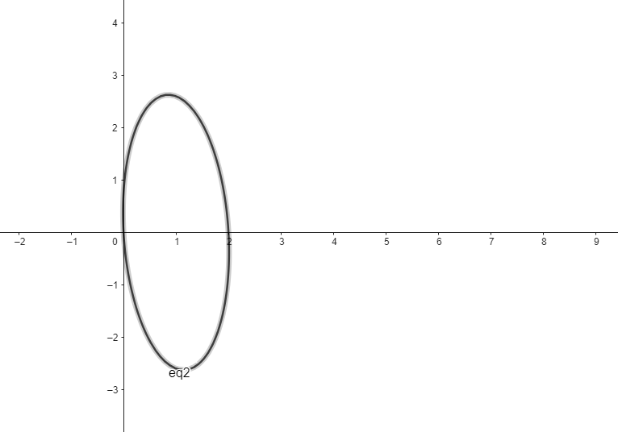
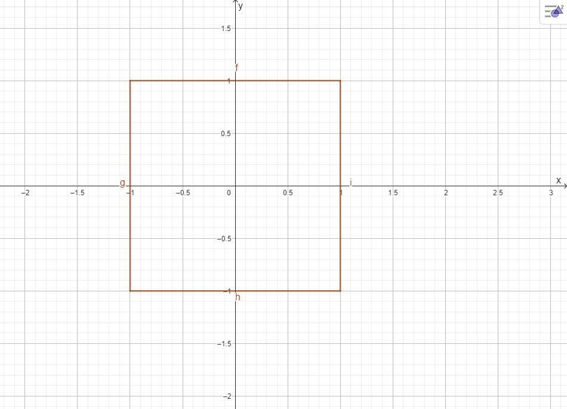

```{r setup, include=FALSE}
knitr::opts_chunk$set(echo = TRUE)

```
## 1.8


# a)

$Dado\left(P,Q\right)=\sqrt{\left(x_1-y_1\right)^2+\ldots+\left(x_p-y_p\right)^2}\ y\ P=\left(-1,-1\right)Q=\left(1,0\right)$

$\rightarrow\ d\left(P,Q\right)=\sqrt{\left(-1-1\right)^2+\left(-1-0\right)^2}=\sqrt{\left(-2\right)^2+\left(-1\right)^2}=\sqrt{4+1}=\sqrt5$

# b)

$Dado\ d\left(P,Q\right)=\sqrt{a_{11}\left(x_1-y_1\right)^2+2a_{12}\left(x_1-y_1\right)\left(x_2-y_2\right)+{a_{22}\left(x_2-y_2\right)}^2}$
$P=\left(-1,-1\right)\ Q=\left(1,0\right)\ \ a_{11}=\frac{1}{3}\ \ a_{22}=\frac{4}{27}\ \ a_{12}=\frac{1}{9}$
$\sqrt{{\frac{1}{3}\left(-1-1\right)}^2+\frac{4}{27}\left(-1-0\right)^2+\left(-1-1\right)\left(-1-0\right)\frac{1}{9}}$
$=\sqrt{\frac{4}{3}+\frac{4}{27}+\frac{2}{9}}=\sqrt{\frac{36+4+6}{27}}=\sqrt{\frac{46}{27}}$

# c)


## 1.10

$Para\ que\ una\ función\ sea\ considerada\ una\ metrica\ se\ deben\ de\ cumplir\ las\ siguientes\ propiedades:$

$d\left(x,y\right)\geq0$

$d\left(x,y\right)=d\left(y,x\right)$

$d\left(x,z\right)\le\ d\left(x,y\right)+d\left(y,z\right)$

$d\left(x,y\right)=0\ \ sii\ \ \ x=y$

# a)
$Para\ d\left(P\right)=x_1^2+4x_2^2+x_2x_1$
  	
$No\ se\ cumple,ya\ que\ para\ p=\left(1,3\right)\ y\ q=\left(3,1\right)\ d\left(x,y\right)\neq\ d\left(y,x\right)$

$1+4\ast9+3=9+4+3\rightarrow40=16\ \ \ !$

# b)
$Para\ d(P)=x^2_1-2x_2^2\ $

$No\ se\ cumple,ya\ que\ para\ p=\left(1,3\right)\ \ d\left(x,y\right)<0$

$1-2\ast9<=0 \  ->\  -17>=0\ !$


## 1.12

# a)

$Sea\ d\left(O,P\right)=\max{\left(\left|x_1\right|,\left|x_2\right|\right)}$

$Para\ P=\left(-3,4\right)=\max{\left(\left|-3\right|,\left|4\right|\right)}=\max{\left(3,4\right)}=4$

# b)



# c)

$Basandonos\ en\ la\ expresión\ original,\ podemos\ generalizar\ la\ expresión\ a\ p\ dimensiones\ de\ $

$\mathrm{la\ siguiente\ manera\ d}\left(\mathrm{P,O}\right)\mathrm{\mathrm{=}}\mathrm{max}{\left(\left|\mathrm{x}_\mathrm{1}\right|\mathrm{,} \left|\mathrm{x}_\mathrm{2}\right|\mathrm{,\ldots,} \left|\mathrm{x}_\mathrm{p}\right|\right)}$

## 1.14

a)

```{r pressure, echo=FALSE}
library(pander)
library(ggplot2)

data=read.table("T1-6.dat")
data$estado=ifelse(data$V6 == 1, "Positive", "Non-Positive")

esclerosis=data[data$V6==1,]
ggplot(esclerosis, aes(x=V2, y=V4)) +
  geom_point()+
  geom_smooth(method=lm, se=FALSE)
```

Paceriera seguir un comportamiento lineal con correalación positiva,  ya que al ajustar una regresión lineal a este conjunto de datos podemos ver de mejor manera esta posible relación.

# b)
Medias para ambas clases

```{r,echo=FALSE}

pander(aggregate(data[, 0:5], list(data$estado), mean))
```
Para esclerosis esto resulta $S_n$
```{r,echo=FALSE}

n <- nrow(esclerosis)
S <- var(esclerosis[,0:5])
Sn <- (n-1)/n * S
pander(Sn)
```

Para no esclerosis esto resulta $S_n$

```{r,echo=FALSE}
noEsclerosis=data[data$V6==0,]
n <- nrow(noEsclerosis)
S <- var(noEsclerosis[,0:5])
Sn <- (n-1)/n * S
pander(Sn)
```
Para esclerosis esta es la matriz R

```{r,echo=FALSE}
pander(cor(esclerosis[,0:5]))
```
Para no esclerosis esta es la matriz R
```{r,echo=FALSE}
pander(cor(noEsclerosis[,0:5]))
```
